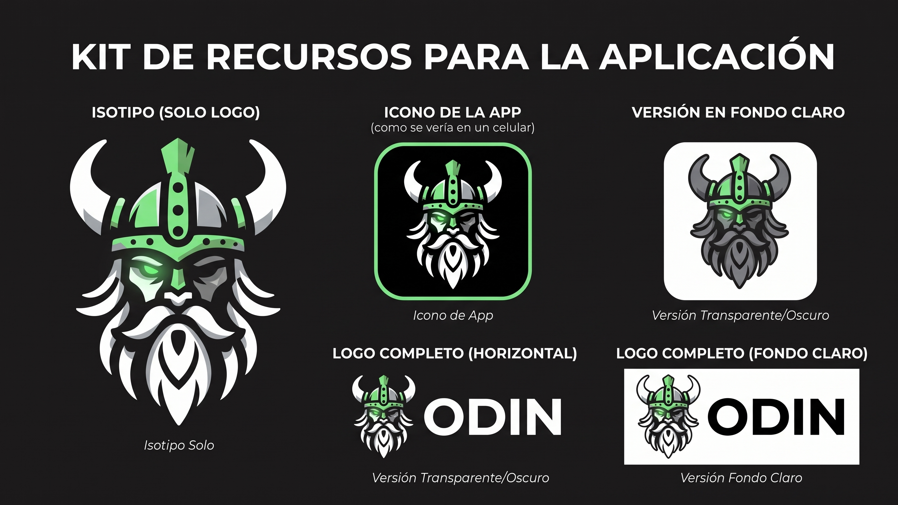
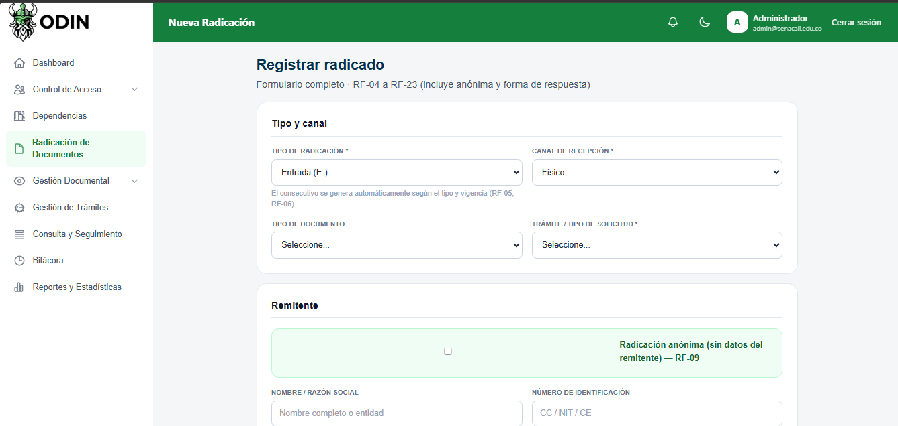
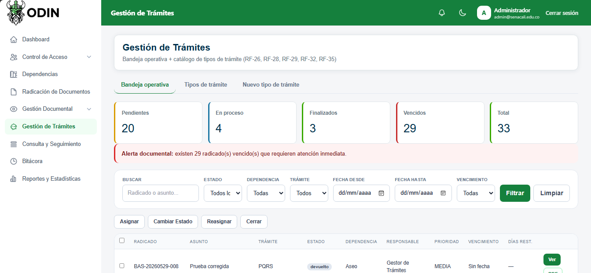
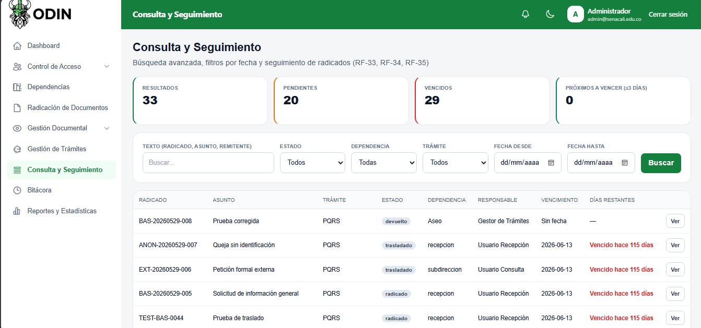
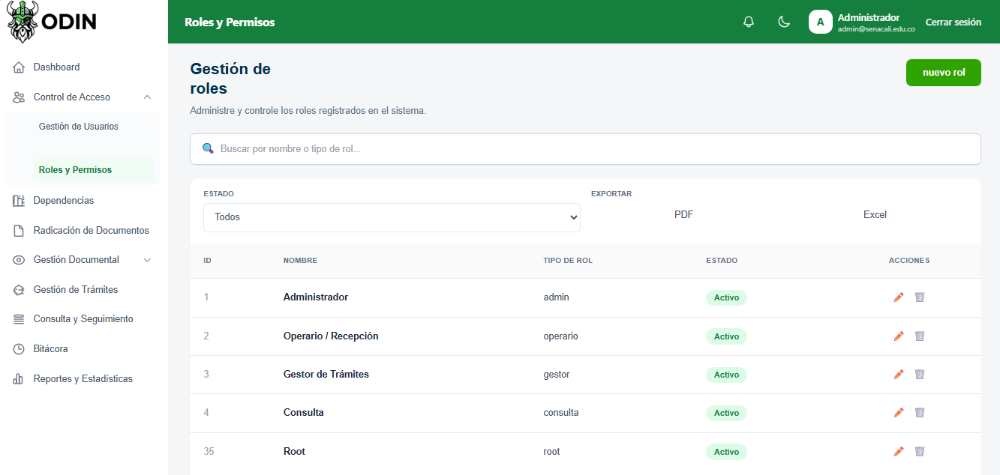

<p align="center">
  
</p>

# ODIN — Sistema de Gestión Documental

<p align="center">
  
  
  
  
</p>

<p align="center">
  <strong>Organización Documental Institucional</strong><br/>
  Gestor documental para el seguimiento, radicación y trazabilidad de trámites<br/>
  en el marco de las prácticas formativas del <strong>SENA</strong>.
</p>

<p align="center">
  <a href="https://github.com/Dinamo-mrm/Gestor-Documental-Odin"></a>
  
  
  
  
</p>

---

## Índice

- [Descripción del proyecto](#descripción-del-proyecto)
- [Estado del proyecto](#estado-del-proyecto)
- [Características principales](#características-principales)
- [Módulos funcionales](#módulos-funcionales)
- [Demo y capturas](#demo-y-capturas)
- [Tecnologías utilizadas](#tecnologías-utilizadas)
- [Arquitectura](#arquitectura)
- [Acceso al proyecto](#acceso-al-proyecto)
- [Requisitos previos](#requisitos-previos)
- [Instalación y puesta en marcha](#instalación-y-puesta-en-marcha)
- [Variables de entorno](#variables-de-entorno)
- [Estructura del repositorio](#estructura-del-repositorio)
- [Base de datos](#base-de-datos)
- [Seguridad](#seguridad)
- [API y documentación](#api-y-documentación)
- [Pruebas](#pruebas)
- [Cumplimiento y normativa](#cumplimiento-y-normativa)
- [Documentación del proyecto](#documentación-del-proyecto)
- [Personas desarrolladoras del proyecto](#personas-desarrolladoras-del-proyecto)
- [Supervisión y coordinación](#supervisión-y-coordinación)
- [Contribución](#contribución)
- [Licencia](#licencia)
- [Referencias](#referencias)

---

## Descripción del proyecto

**ODIN** (Organización Documental Institucional) es un sistema web de **gestión documental** orientado a instituciones de formación como el SENA. Centraliza el ciclo de vida de los documentos y trámites:

1. **Recepción y radicación** (interna, externa y anónima)
2. **Clasificación** según Cuadro de Clasificación Documental (CCD / series y subseries)
3. **Gestión de trámites** (asignación, reasignación, estados, plazos)
4. **Consulta y seguimiento** con trazabilidad completa
5. **Administración de usuarios, roles y permisos**
6. **Reportes, notificaciones y auditoría**

El sistema responde a necesidades de **transparencia, control de tiempos de respuesta, trazabilidad inmutable y alineación con la Ley 594 de 2000** (Ley General de Archivos) y lineamientos de identidad visual institucional SENA.

> **Problema que resuelve:** dispersión de radicados, falta de visibilidad de vencimientos, debilidad en la cadena de custodia digital y ausencia de un flujo unificado de seguimiento para aprendices y funcionarios.

---

## Estado del proyecto

| Aspecto | Estado |
|--------|--------|
| Análisis y requisitos (RF / RNF / CU) | Documentación consolidada |
| Modelo de datos (Supabase PostgreSQL) | Estable (~26–30 tablas core) |
| Backend Spring Boot + JPA | Candidato a entrega técnica |
| Interfaces Thymeleaf (UI institucional) | Alto cumplimiento de RF de pantalla |
| Seguridad (login, RBAC, sesión, auditoría) | Avanzado — requiere pruebas E2E de cierre |
| Compilación / empaquetado | Correcciones de build integradas |
| Producción / certificación operacional | Pendiente de pruebas runtime y hardening BD |

**Versión de referencia del código:** paquete final `Odinend` (octubre 2026) — unificado + hotfixes de compilación, timeline de consulta y seguridad.

**Repositorio:** [Dinamo-mrm/Gestor-Documental-Odin](https://github.com/Dinamo-mrm/Gestor-Documental-Odin)

---

## Características principales

- Login flexible (correo, número de identificación o nombre)
- Radicación con número consecutivo, anexos y **comprobante PDF** institucional (sello *COPIA CONTROLADA*, barras SENA `#39A900`, QR de verificación)
- Clasificación documental CCD (unidades, series, subseries, retención y disposición)
- Bandeja de trámites unificada (KPIs, filtros por fecha/estado, días restantes)
- Consulta y seguimiento con **línea temporal** (eventos, usuario, dependencia, estado, documentos, observaciones)
- Roles y permisos granulares (`crear_radicado`, `admin_usuarios`, `ver_reportes`, etc.)
- Auditoría de accesos y movimientos sobre radicados
- Recuperación de contraseña por token (SMTP configurable)
- Control de sesión concurrente y bloqueo temporal por intentos fallidos
- Exportaciones administrativas (PDF / Excel según módulos)
- Identidad visual SENA (verde institucional, tipografía y componentes homogéneos)

<p align="center">
  
</p>
<p align="center"><em>Kit de recursos e identidad visual ODIN · SENA</em></p>

---

## Módulos funcionales

| Módulo | Descripción |
|--------|-------------|
| **Radicación y recepción** | Alta de radicados, anónimos, forma de respuesta, adjuntos |
| **Gestión integral de trámites** | Tipos de trámite, plazos, asignación, cierre, firmas |
| **Consulta y seguimiento** | Búsqueda, filtros, detalle, timeline, días restantes |
| **Administración y seguridad** | Usuarios, roles, `rol_permisos`, sesiones, logs |
| **CCD / estructura documental** | Unidades, series, subseries, dependencias |
| **Reportes y notificaciones** | Indicadores, alertas y exportaciones |
| **Bitácora / auditoría** | Historial de acciones sobre radicados y accesos |

---

## Demo y capturas

Capturas del paquete final ODIN (identidad SENA, layout institucional).

| Pantalla | Descripción | Captura |
|----------|-------------|---------|
| Login | Acceso institucional con modo claro/oscuro |  |
| Dashboard | KPIs de radicados, pendientes y vencidos |  |
| Radicación | Formulario completo + comprobante PDF |  |
| Gestión de trámites | Bandeja + catálogo de tipos |  |
| Consulta | Filtros, días restantes y detalle con timeline |  |
| Roles | Matriz visual de permisos |  |

### Galería

<p align="center">
  
</p>
<p align="center"><em>Login — acceso con correo, identificación o nombre</em></p>

<p align="center">
  
</p>
<p align="center"><em>Dashboard — KPIs operativos</em></p>

<p align="center">
  
</p>
<p align="center"><em>Radicación — datos, anexos y comprobante PDF</em></p>

<p align="center">
  
</p>
<p align="center"><em>Gestión de trámites — bandeja, filtros y días restantes</em></p>

<p align="center">
  
</p>
<p align="center"><em>Consulta y seguimiento — filtros y línea temporal</em></p>

<p align="center">
  
</p>
<p align="center"><em>Roles — matriz visual de permisos</em></p>

Comprobante PDF de ejemplo:

`docs/integracion_ui/ejemplo/ODIN_Comprobante_Radicacion_Ejemplo.pdf`

---

## Tecnologías utilizadas

### Backend

| Tecnología | Uso |
|------------|-----|
| **Java 17** | Lenguaje base |
| **Spring Boot** | Aplicación web y API |
| **Spring Security** | Autenticación, autorización, sesiones |
| **Spring Data JPA / Hibernate** | Persistencia |
| **Thymeleaf** | Vistas server-side |
| **Spring Mail** | Recuperación de contraseña |
| **OpenPDF** | Generación de comprobantes PDF |
| **ZXing** | Códigos QR en comprobantes |
| **Apache POI** | Exportaciones Excel |
| **springdoc-openapi** | Documentación Swagger/OpenAPI |
| **Lombok** | Reducción de boilerplate |
| **Maven Wrapper** | Build reproducible |

### Frontend (plantillas)

| Tecnología | Uso |
|------------|-----|
| HTML5 / CSS3 | Estructura y estilos institucionales |
| Tailwind CSS (CDN) | Utilidades de layout |
| JavaScript | Interacciones, modales, tema oscuro |

### Datos e infraestructura

| Tecnología | Uso |
|------------|-----|
| **PostgreSQL** (Supabase) | Base de datos oficial |
| Variables de entorno | Credenciales y SMTP sin secretos en Git |
| HikariCP | Pool de conexiones |

---

## Arquitectura

```text
Navegador (Thymeleaf + JS)
        │
        ▼
 Spring Security (sesión, CSRF en vistas, RBAC)
        │
        ▼
 Spring Boot Controllers / Views
        │
        ▼
 Servicios de dominio (radicación, plazos, PDF, auditoría)
        │
        ▼
 Spring Data JPA
        │
        ▼
 PostgreSQL en Supabase
```

**Nota de seguridad:** el acceso a datos se realiza por el backend (JDBC). No se expone el modelo vía cliente `supabase-js` en el flujo principal. Las políticas RLS en Supabase refuerzan el cierre frente a Data API / roles `anon`.

---

## Acceso al proyecto

- **Repositorio:** [Dinamo-mrm/Gestor-Documental-Odin](https://github.com/Dinamo-mrm/Gestor-Documental-Odin)
- **Entorno local:** `http://localhost:8080` tras arrancar la aplicación
- **Login:** `/login`
- **Swagger (si está habilitado para admin):** `/swagger-ui.html`

---

## Requisitos previos

- **JDK 17+**
- **Maven 3.9+** (o usar `./mvnw` incluido)
- Proyecto **Supabase / PostgreSQL** con el esquema ODIN aplicado
- (Opcional) servidor **SMTP** para recuperación de contraseña
- Git

---

## Instalación y puesta en marcha

### 1. Clonar el repositorio

```bash
git clone https://github.com/Dinamo-mrm/Gestor-Documental-Odin.git
cd Gestor-Documental-Odin
```

### 2. Configurar variables de entorno

```bash
cp .env.example .env
# Editar .env con las credenciales reales de Supabase (nunca subir .env a Git)
```

### 3. Aplicar migraciones SQL (si aplica)

Ejecutar en el SQL Editor de Supabase los scripts de:

```text
database/migrations/
```

### 4. Compilar y ejecutar

```bash
./mvnw -DskipTests package
./mvnw spring-boot:run
```

O desde el IDE: ejecutar la clase `com.odin.odin.OdinApplication`.

### 5. Abrir la aplicación

```text
http://localhost:8080/login
```

---

## Variables de entorno

| Variable | Descripción |
|----------|-------------|
| `SUPABASE_DB_URL` | JDBC URL de PostgreSQL (pooler recomendado + `sslmode=require`) |
| `SUPABASE_DB_USERNAME` | Usuario de base de datos |
| `SUPABASE_DB_PASSWORD` | Contraseña |
| `SMTP_HOST` / `SMTP_PORT` | Servidor de correo (recuperación de clave) |
| `SMTP_USERNAME` / `SMTP_PASSWORD` | Credenciales SMTP |
| `MAIL_FROM` | Remitente de correos |
| `APP_BASE_URL` | URL base pública (enlaces de restablecimiento) |
| `RESET_PASSWORD_EXPIRATION_MINUTES` | Vigencia del token (default 30) |
| `app.security.max-failed-attempts` | Intentos fallidos antes de bloqueo (default 5) |
| `app.security.lockout-minutes` | Minutos de bloqueo (default 15) |
| `app.security.swagger-public` | `false` en producción (Swagger solo admin) |

---

## Estructura del repositorio

```text
Odin/
├── pom.xml
├── mvnw / mvnw.cmd
├── .env.example
├── database/migrations/                 # Scripts SQL
├── docs/
│   ├── capturas/                        # Logo, kit y pantallas
│   ├── ODIN_Documentacion_Completa/     # G1–G4, diagramas, checklist
│   └── integracion_ui/                  # Guías de UI / PDF
├── src/main/java/com/odin/odin/
│   ├── config/
│   ├── controller/
│   ├── view/
│   ├── model/
│   ├── repository/
│   ├── service/
│   ├── dto/
│   └── util/
└── src/main/resources/
    ├── application.properties
    ├── static/
    └── templates/
```

---

## Base de datos

Esquema relacional en **PostgreSQL (Supabase)**, organizado en grupos:

1. **Seguridad y usuarios** — `usuarios`, `roles`, `permisos`, `rol_permisos`, `sesiones_usuario`, `log_accesos`, `reset_password_tokens`
2. **Estructura y CCD** — `dependencias`, `ccd_unidades`, `ccd_series`, `ccd_subseries`
3. **Core de radicación** — `radicados`, `tramites`, `estados`, `documentos`, `anexos`, `remitentes_externos`, `expedientes`
4. **Trazabilidad** — `historial_radicado`, `observaciones`, `reasignaciones`, `firmas`, `notificaciones`, `auditoria_radicados`, `plantilla`

El diccionario de datos y diagramas ER se documentan en el **Grupo 4 (Modelo de Datos)**.

---

## Seguridad

- Contraseñas con **BCrypt**
- Autorización por **permisos granulares** cargados desde `rol_permisos`
- Validación de usuario y rol **activos**
- Auditoría de login / logout / fallos
- **Una sesión concurrente** por usuario (la nueva invalida la anterior)
- Bloqueo temporal tras intentos fallidos configurables
- Página de acceso denegado `/403`
- CSRF activo en formularios Thymeleaf; APIs JSON bajo criterio documentado
- Swagger restringido a roles administrativos en configuración recomendada de producción

---

## API y documentación

- Endpoints REST bajo `/api/**` (radicados, usuarios, trámites, notificaciones, etc.)
- Vistas MVC bajo `/view/**`
- OpenAPI / Swagger UI (habilitación según perfil y permisos)

Ejemplo de comprobante:

```http
GET /api/radicados/{id}/comprobante
```

---

## Pruebas

```bash
./mvnw test
```

**Pruebas recomendadas antes del cierre operacional:**

1. Login (correo / identificación / nombre) y usuario inactivo
2. Matriz de permisos → respuesta **403** cuando no aplica
3. Logout y sesión concurrente
4. Recuperación de contraseña (con SMTP de prueba)
5. Flujo radicar → asignar → consultar timeline → descargar PDF
6. Filtros de consulta y días restantes / vencidos

---

## Cumplimiento y normativa

- **Ley 594 de 2000** — Ley General de Archivos (referencia de diseño)
- Clasificación y retención orientadas a **CCD / TRD** institucional
- **Manual de identidad visual SENA 2024** — color primario `#39A900`, uso controlado del logo
- Principios de trazabilidad, no repudio operativo y control de acceso por rol

---

## Documentación del proyecto

ODIN cuenta con un **paquete documental formal** alineado a ingeniería de software. En el paquete final (`Odinend`) se encuentra en:

```text
docs/ODIN_Documentacion_Completa/
├── 01_Documentos_Principales/   # G1 Requerimientos · G2 HU · G3 CU · G4 Modelo de datos · Consolidado
├── 02_Anexos_Diagramas/         # ER, casos de uso, secuencias, despliegue (.puml + .png)
└── 03_Checklist/                # Checklist de cierre técnico
```

### Entregables principales (Grupos 1–4)

| Grupo | Documento | Descripción |
|-------|-----------|-------------|
| **G1** | `ODIN_G1_Requerimientos_v3.2_20261004.docx` | Requerimientos funcionales y no funcionales |
| **G2** | `ODIN_G2_HistoriasUsuario_v3.0_20261004.docx` | Historias de usuario |
| **G3** | `ODIN_G3_CasosUso_v3.0_20261004.docx` | Casos de uso |
| **G4** | `ODIN_G4_ModeloDatos_v5.0_20261004.docx` | Modelo de datos / diccionario |
| — | `ODIN_Documentacion_Tecnica_Consolidada_v5.0_20261004.docx` | Documentación técnica consolidada |
| — | `ODIN_Diagramas_v3_Ingenieria_Inversa.docx` | Diagramas de ingeniería |
| — | `ODIN_Checklist_Pendientes_Cierre_Tecnico_v2_20261004.docx` | Checklist de cierre |

### Alcance documental cubierto

- Descripción e identificación de procesos
- Stakeholders y levantamiento de requisitos
- RF / RNF por módulo
- Historias de usuario y casos de uso
- Modelo de datos alineado a Supabase + JPA
- Matrices de trazabilidad y cumplimiento
- Identidad visual SENA y criterios de UI
- Checklists de pendientes y cierre

---

## Personas desarrolladoras del proyecto

Proyecto formativo **SENA**. Los usuarios y colaboradores se extrajeron del repositorio  
[Dinamo-mrm/Gestor-Documental-Odin](https://github.com/Dinamo-mrm/Gestor-Documental-Odin) (permisos + commits públicos).

### Equipo base — colaboradores del repositorio

<table>
  <tr>
    <td align="center">
      <a href="https://github.com/Dinamo-mrm">
        <br/>
        <sub><b>Carlos Edo. Barahona</b></sub>
      </a><br/>
      <sub>Admin · owner del repo</sub><br/>
      <sub>~157 commits</sub>
    </td>
    <td align="center">
      <a href="https://github.com/diealeolagon-sketch">
        <br/>
        <sub><b>Diego Olaya</b></sub>
      </a><br/>
      <sub>@diealeolagon-sketch · write</sub><br/>
      <sub>~20 commits</sub>
    </td>
    <td align="center">
      <a href="https://github.com/juancamilo343">
        <br/>
        <sub><b>juancamilo343</b></sub>
      </a><br/>
      <sub>Write · radicación / G1·G3</sub><br/>
      <sub>~14 commits</sub>
    </td>
  </tr>
  <tr>
    <td align="center">
      <a href="https://github.com/JJMA04-code">
        <br/>
        <sub><b>JJMA04-code</b></sub>
      </a><br/>
      <sub>Write</sub><br/>
      <sub>~7 commits</sub>
    </td>
    <td align="center">
      <a href="https://github.com/norx01">
        <br/>
        <sub><b>Juan Pablo Pinillos</b></sub>
      </a><br/>
      <sub>Write · ingeniería / proyectos</sub><br/>
      <sub>~5 commits</sub>
    </td>
  </tr>
</table>

### Desarrollo y módulos funcionales (Grupos 1 · 2 · 3 · 4)

| Grupo | Entregable | Descripción |
|-------|------------|-------------|
| **Grupo 1** | Requerimientos (RF / RNF) | Levantamiento, priorización y especificación funcional / no funcional |
| **Grupo 2** | Historias de usuario | Historias, criterios de aceptación y valor de negocio |
| **Grupo 3** | Casos de uso | Flujos principales, alternos y excepciones |
| **Grupo 4** | Modelo de datos | Diccionario, ER, alineación JPA / Supabase |

| Usuario GitHub | Rol en repo | Aporte orientativo |
|----------------|-------------|--------------------|
| [@Dinamo-mrm](https://github.com/Dinamo-mrm) | **admin** | Integración general, owner del repositorio |
| [@diealeolagon-sketch](https://github.com/diealeolagon-sketch)  | write |  Desarrollo y módulos funcionales |
| [@juancamilo343](https://github.com/juancamilo343) | write | Radicación  |
| [@JJMA04-code](https://github.com/JJMA04-code) | write | Desarrollo colaborativo |
| [@norx01](https://github.com/norx01) | write |  Acompañamiento técnico / ingeniería |

\*Conteos según API pública de GitHub (`/contributors`) al momento del análisis del repo.

### Roles de trabajo en el ciclo documental

| Rol | Actividades |
|-----|-------------|
| Análisis de requisitos | Entrevistas, cuestionarios, RF/RNF, priorización |
| Historias de usuario y casos de uso | Flujos principales, alternos y excepciones |
| Modelo de datos | Diccionario, ER, alineación JPA / Supabase |
| Implementación | Spring Boot, Thymeleaf, seguridad, PDF, bandejas |
| Pruebas y calidad | Casos de prueba, checklists, validación doc vs programa |
| Documentación técnica | Consolidado, matrices, portada de entrega |

---

## Supervisión y coordinación

<table>
  <tr>
    <td align="center">
      <a href="https://github.com/Dinamo-mrm">
        <br/>
      <sub><b>Carlos Eduardo Barahona</b></sub><br/>
      <sub>Supervisión ODIN (documentación, desarrollo y entregables)</sub>
    </td>
    <td align="center">
      <a href="https://github.com/norx01">
        <br/>
      <sub><b>Juan Pablo Pinillos</b></sub><br/>
      <sub>Instructor y coordinación del proyecto</sub>
    </td>
  </tr>
</table>

---

## Contribución

1. Cree una rama desde `main` (`feature/…` o `fix/…`)
2. Realice commits claros y atómicos
3. Asegúrese de no incluir `.env`, secretos ni `target/`
4. Abra un Pull Request describiendo el cambio y las pruebas realizadas
5. Respete la identidad visual y los permisos de seguridad existentes

Colaboradores con permiso **write** en el repo:  
`Dinamo-mrm` (admin), `diealeolagon-sketch`, `juancamilo343`, `JJMA04-code`, `norx01`.

---

## Licencia

Uso **institucional / formativo SENA**.  
No constituye un producto comercial independiente. Consulte con la coordinación del proyecto las condiciones de publicación y reutilización del código.

---

## Referencias

- Repositorio: [Dinamo-mrm/Gestor-Documental-Odin](https://github.com/Dinamo-mrm/Gestor-Documental-Odin)
- [Cómo escribir un README increíble en tu GitHub — Alura](https://www.aluracursos.com/blog/como-escribir-un-readme-increible-en-tu-github)
- Manual de identidad visual SENA 2024
- Ley 594 de 2000 (Ley General de Archivos)
- Documentación técnica consolidada ODIN (`docs/ODIN_Documentacion_Completa/`)
- Spring Boot / Spring Security documentation

---

<p align="center">
  <br/>
  <sub>ODIN — Organización Documental Institucional · SENA</sub><br/>
  <sub>Hecho con rigor técnico para la gestión documental formativa</sub>
</p>
