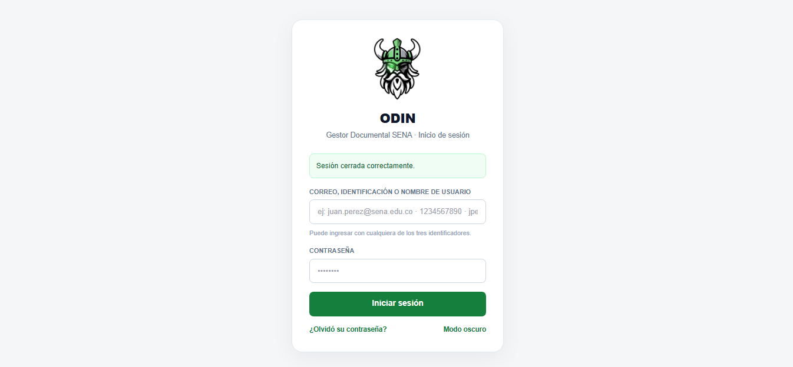
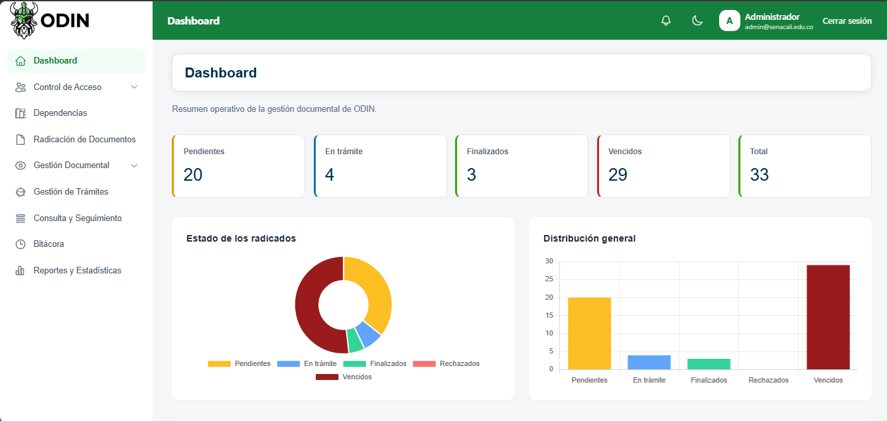
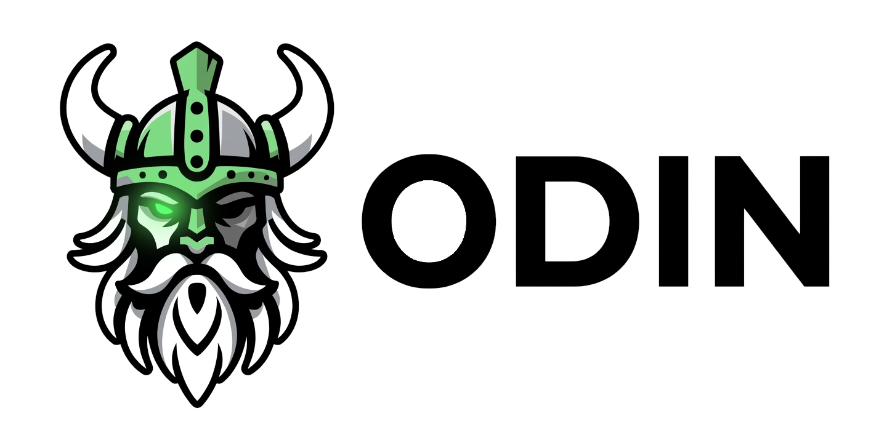

<p align="center">
  
</p>

# ODIN — Sistema de Gestión Documental

<p align="center">
  
  
  
  
</p>

<p align="center">
  <strong>Organización Documental Institucional</strong><br/>
  Gestor documental para el seguimiento, radicación y trazabilidad de trámites<br/>
  en el marco de las prácticas formativas del <strong>SENA</strong>.
</p>

<p align="center">
  <a href="https://github.com/Dinamo-mrm/Gestor-Documental-Odin"></a>
  
  
</p>

---

## Documentación completa

La documentación detallada del proyecto (módulos, instalación, equipo, capturas, grupos 1–4 y seguridad) está en:

### **[→ Abrir README completo del proyecto (Odin/README.md)](Odin/README.md)**

---
### Equipo base — colaboradores del repositorio

<table>
  <tr>
    <td align="center">
      <a href="https://github.com/norx01">
        <br/>
        <sub><b>Juan Pablo Pinillos</b></sub>
      </a><br/>
      <sub>Write · ingeniería / proyectos</sub><br/>
    </td>
    <td align="center">
      <a href="https://github.com/Dinamo-mrm">
        <br/>
        <sub><b>Carlos Edo. Barahona</b></sub>
      </a><br/>
      <sub>Admin · owner del repo</sub><br/>
    </td>
    <td align="center">
      <a href="https://github.com/diealeolagon-sketch">
        <br/>
        <sub><b>Diego Olaya</b></sub>
      </a><br/>
      <sub> write</sub><br/>
      <sub>~20 commits</sub>
    </td>
    <td align="center">
      <a href="https://github.com/juancamilo343">
        <br/>
        <sub><b>juancamilo343</b></sub>
      </a><br/>
      <sub>Write · radicación / G1·G3</sub><br/>
    </td>
    <td align="center">
      <a href="https://github.com/JJMA04-code">
        <br/>
        <sub><b>JJMA04-code</b></sub>
      </a><br/>
      <sub>Write</sub><br/>
    </td>
  </tr>
</table>

---

## Arranque rápido

```bash
git clone https://github.com/Dinamo-mrm/Gestor-Documental-Odin.git
cd Gestor-Documental-Odin/Odin
cp .env.example .env   # configurar Supabase
./mvnw -DskipTests package
./mvnw spring-boot:run
```

Abrir: `http://localhost:8080/login`

---

## Estructura del repositorio

```text
Gestor-Documental-Odin/     ← raíz (este README.md se muestra en GitHub)
├── README.md               ← portada del repositorio
├── Odin/                   ← aplicación Spring Boot
│   ├── README.md           ← documentación completa
│   ├── pom.xml
│   ├── docs/capturas/      ← logos y pantallas
│   └── src/
├── .github/workflows/
└── .gitignore
```

---

## Capturas

<p align="center">
  
</p>
<p align="center"><em>Login institucional ODIN</em></p>

<p align="center">
  
</p>
<p align="center"><em>Dashboard — KPIs operativos</em></p>

Más capturas y detalle del equipo, seguridad, RF y modelo de datos: **[Odin/README.md](Odin/README.md)**.

---

<p align="center">
  <br/>
  <sub>ODIN — Organización Documental Institucional · SENA</sub>
</p>
